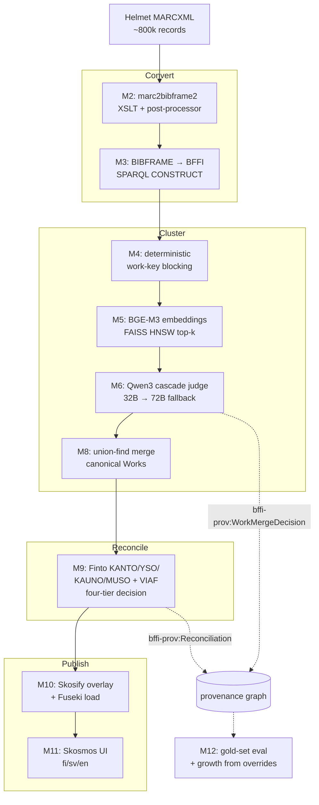

# BFFI pipeline

MARCXML → BFFI authority Works/Expressions → Skosmos.

This pipeline takes ~800 000 Helmet MARCXML bibliographic records,
clusters them into canonical [BFFI](https://schema.finto.fi/bffi/)
Works and Expressions using deterministic blocking + embedding
candidate generation + a local-LLM judge cascade, reconciles
creators and subjects against KANTO / VIAF / YSO / KAUNO / MUSO,
and publishes the result through Skosmos so cataloguers can browse
the authority graph.

It is **pro bono** work for the [National Library of Finland](https://www.kansalliskirjasto.fi/)
and is intended for upstream contribution alongside the existing
NLF tooling. **No paid LLM APIs**: all inference runs locally on
Apple Silicon. Code is **Apache 2.0** (matching NLF tools);
published RDF data is **CC0** (matching Finto vocabularies).

## Architecture



Each box is a pipeline stage. The M-prefixed stage IDs (M2, M3, M5,
M6, M8, M9, M10) are the canonical identifiers used throughout the
code and docs.  Stage code lives in
[`src/bffi_pipeline/stages/`](src/bffi_pipeline/stages/);
orchestration in [`src/bffi_pipeline/cli.py`](src/bffi_pipeline/cli.py).

The MARCXML at the head of the diagram is produced by a sibling package,
[`src/marcxml_export_pipeline/sierra/`](src/marcxml_export_pipeline/sierra/),
which streams Helmet's Sierra Postgres replica and writes per-bib
MARCXML files (synthesising MARC 001/003/005/907 when the source row
lacks them, which is what keeps the marc2bibframe2 → BFFI work-key
contract clean downstream). It is shipped as its own CLI entry point —
`marcxml-export-sierra` — so the repository can grow other ILS sources
(Koha, Alma, …) without entangling them with the BFFI pipeline itself.

## Prerequisites

The full pipeline targets **Apple Silicon — MacBook Pro M5 Max
with 128 GB unified memory**. The corpus loads, the index fits,
the LLM cascade runs locally without OOMing. Smaller machines run
the development stack and the gold-set eval, but the
800 k-record production batch needs the M5 Max envelope.

### Toolchain

- **Python 3.14** via [uv](https://github.com/astral-sh/uv) — the project pins everything in `uv.lock`.
- **mlx-lm** on `:8001` (primary) + `:8002` (fallback) for the LLM judge + reconciliation picker. Full installation walkthrough in [`docs/local-inference.md`](docs/local-inference.md#installation).
- **Docker** (or Podman with `docker-compose`) for Fuseki and Skosmos. Both containers build from source — NatLibFi's Skosmos doesn't publish a Docker image, and we pin Apache Jena Fuseki via the JAR version Skosmos's vendored Dockerfile downloads at build time.
- **git** with submodule support — `marc2bibframe2` and `Skosmos` (pinned at `v3.2`) are vendored under `third_party/`.

### Pinned versions

| Component | Pinned | Notes |
|---|---|---|
| `marc2bibframe2` | `third_party/marc2bibframe2` (git submodule) | M2 XSLT |
| Embedding model | `BAAI/bge-m3` (1024-dim, multilingual) | M5; verify with `bffi-pipeline embed-benchmark` |
| FAISS HNSW | `M=32`, `efConstruction=200`, `efSearch=64`, IP metric on L2-normalised vectors | M5 |
| LLM primary | `Qwen3-8B-4bit` (mlx-lm; `Qwen/Qwen3-8B-MLX-4bit`) | M6 / M9 picker |
| LLM fallback | `Qwen3-32B-4bit` (mlx-lm; `Qwen/Qwen3-32B-4bit`) | M6 cascade |
| Apache Jena Fuseki | `5.4.0` (downloaded by Skosmos's vendored Dockerfile) | M10 load target |
| Skosmos | `third_party/Skosmos` (git submodule pinned at `v3.2`) | M11 UI |

## Production run

The 800 k-record path, with expected timings on the M5 Max,
pinned versions, and the cataloguer smoke checklist, is in
[`docs/runbook.md`](docs/runbook.md). Start there before kicking
off a full corpus pass — multi-night LLM batches are easier to
plan than to interrupt.

## Testing, CI, and the LLM eval

```bash
make lint   # ruff + ruff format --check + mypy --strict
make test   # pytest tests/ -m "not requires_llm"
make eval LABEL=qwen3-32b-prompt-v3   # gold-set eval; requires local LLM
```

CI runs [`make lint`](Makefile) + unit + integration tests on
GitHub-hosted Ubuntu runners (see
[`.github/workflows/ci.yml`](.github/workflows/ci.yml)). The LLM
eval is **not** in CI — it runs manually on the M5 Max before any
PR touching `prompts/`, `gold/`, `src/bffi_pipeline/stages/judge.py`,
or `src/bffi_pipeline/eval/`. The
[PR template](.github/pull_request_template.md) prompts for paste-ready
output.

`tests/integration/` carries `requires_llm`-marked tests that
exercise the real local cascade end-to-end; they are excluded from
CI via `-m "not requires_llm"` and run on demand on the M5 Max.

## Operating constraints

- **Apache 2.0** code (matching NLF tools); **CC0** published RDF data (matching Finto vocabularies).
- **No paid API services** for inference. mlx-lm on Apple Silicon, locally.
- **No telemetry / error reporting.** Provenance is in-graph (`bffi-prov:` namespace).
- **`mypy --strict` everywhere** in `src/`. Pydantic v2 at module boundaries; frozen dataclasses for internal value objects.
- **Stage isolation:** modules under `src/bffi_pipeline/stages/` don't import each other; orchestration goes through `cli.py`. Cross-stage helpers live at the package root (`uris.py`, `blocking.py`).
- **Idempotent stages, atomic writes.** Each stage skips when its output is newer than its input unless `--force`.

## Committed identifiers (do not change without surfacing)

| Namespace | URI |
|---|---|
| Work | `http://urn.fi/URN:NBN:fi:bib:work:` |
| Expression | `http://urn.fi/URN:NBN:fi:bib:expression:` |
| Helmet source | `http://urn.fi/URN:NBN:fi:bib:source:helmet` |
| Named-graph base | `http://urn.fi/URN:NBN:fi:bib:graph:` |
| `bffi-prov` | `http://urn.fi/URN:NBN:fi:schema:bffi-prov#` |

## License

Code: [Apache License 2.0](LICENSE). Copyright (c) 2026 University
Of Helsinki (The National Library Of Finland).

Published RDF data: [CC0 1.0 Universal](https://creativecommons.org/publicdomain/zero/1.0/),
matching the Finto vocabulary licensing.
