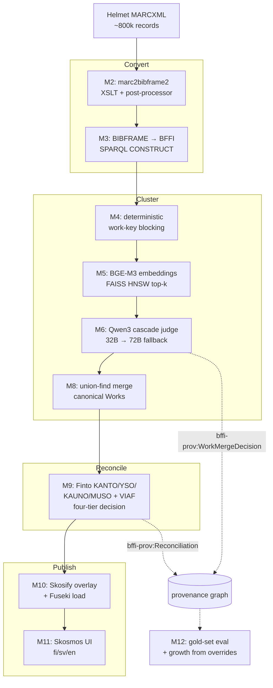

# BFFI pipeline

MARCXML → BFFI authority Works/Expressions → Skosmos.

This pipeline takes ~800 000 Helmet MARCXML bibliographic records,
clusters them into canonical [BFFI](https://schema.finto.fi/bffi/)
Works and Expressions using deterministic blocking + embedding
candidate generation + a local-LLM judge cascade, reconciles
creators and subjects against KANTO / VIAF / YSO / KAUNO / MUSO,
and publishes the result through Skosmos so cataloguers can browse
the authority graph.

It is **pro bono** work for the [National Library of Finland](https://www.kansalliskirjasto.fi/)
and is intended for upstream contribution alongside the existing
NLF tooling. **No paid LLM APIs**: all inference runs locally on
Apple Silicon. Code is **Apache 2.0** (matching NLF tools);
published RDF data is **CC0** (matching Finto vocabularies).

## Architecture



Each box maps to a milestone in [`docs/BUILD_PLAN.md`](docs/BUILD_PLAN.md).
Stage code lives in [`src/bffi_pipeline/stages/`](src/bffi_pipeline/stages/);
orchestration in [`src/bffi_pipeline/cli.py`](src/bffi_pipeline/cli.py).

## Prerequisites

The full pipeline targets **Apple Silicon — MacBook Pro M5 Max
with 128 GB unified memory**. The corpus loads, the index fits,
the LLM cascade runs locally without OOMing. Smaller machines run
the development stack and the gold-set eval, but the
800 k-record production batch needs the M5 Max envelope.

Toolchain:

- **Python 3.12** via [uv](https://github.com/astral-sh/uv) — the project pins everything in `uv.lock`.
- **Ollama** (or vllm-mlx for production) on `:11434` for the LLM judge + reconciliation picker. Full installation walkthrough in [`docs/local-inference.md`](docs/local-inference.md#installation).
- **Docker** + `docker compose` for Fuseki and Skosmos.
- **git** with submodule support — `marc2bibframe2` is vendored under `third_party/`.

One-time install:

```bash
git clone --recurse-submodules https://github.com/<org>/helmet-marcxml-bffi-skos-pipeline.git
cd helmet-marcxml-bffi-skos-pipeline
uv sync                                    # fetches every pinned dep
cp .env.example .env                       # carries the committed LLM defaults
brew install --cask ollama && open -a Ollama
ollama pull qwen3:32b-instruct-q4_K_M      # primary judge (~20 GB)
ollama pull qwen3:72b-instruct-q4_K_M      # cascade fallback (~40 GB)
docker compose up -d                       # Fuseki + Skosmos
```

### Local LLM setup

The judge and reconciliation picker both call a local OpenAI-compatible
server. The end-to-end install — Ollama for development and gold-set
runs, vllm-mlx for production batches, model conversion, the
`.env` wiring, and a one-shot verification probe — is documented in
**[`docs/local-inference.md`](docs/local-inference.md#installation)**.
Follow that section before running `bffi-pipeline judge` or
`bffi-pipeline reconcile` for the first time.

## Quick start — sample data

```bash
# Convert + cluster + reconcile + publish a small fixture set.
bffi-pipeline marc-to-bf tests/data/sample-marcxml/curated
bffi-pipeline bf-to-bffi
bffi-pipeline embed
bffi-pipeline judge
bffi-pipeline merge
bffi-pipeline reconcile
bffi-pipeline skosify
bffi-pipeline load
```

Open [http://localhost:9090](http://localhost:9090) for the Skosmos UI.

## Production run

The 800 k-record path, with expected timings on the M5 Max,
pinned versions, and the cataloguer smoke checklist, is in
[`docs/runbook.md`](docs/runbook.md). Start there before kicking
off a full corpus pass — multi-night LLM batches are easier to
plan than to interrupt.

## Repository layout

```
.
├── CLAUDE.md                  # session conventions; read first
├── docs/
│   ├── BUILD_PLAN.md          # milestone-ordered checklist (M0-M13)
│   ├── runbook.md             # canonical end-to-end recipe
│   ├── marcxml-to-bffi-skosmos-pipeline.md  # technical spec
│   ├── validation-strategy.md # five validation boundaries
│   ├── local-inference.md     # Apple Silicon / Ollama / model choice
│   └── ci-strategy.md         # CI + PR template rationale
├── src/bffi_pipeline/
│   ├── stages/                # per-milestone stage code (don't cross-import)
│   ├── eval/                  # gold-set loader, harness, growth
│   ├── provenance/            # PROV-O + bffi-prov writer / compaction
│   ├── validation/            # SHACL boundary validators
│   ├── blocking.py uris.py    # M1 + M4 cross-stage helpers
│   └── cli.py                 # typer entry point
├── prompts/                   # versioned LLM prompts (hashed at runtime)
├── sparql/                    # versioned SPARQL queries
├── config/                    # Skosify overlay, Skosmos config, SHACL shapes
├── gold/                      # gold-set JSONL for the eval harness
├── third_party/marc2bibframe2 # NLF/LoC XSLT, vendored as a submodule
└── docker-compose.yml         # Fuseki 5.0.0 + Skosmos 3.2 (pinned)
```

## Testing, CI, and the LLM eval

```bash
make lint   # ruff + ruff format --check + mypy --strict
make test   # pytest tests/ -m "not requires_llm"
make eval LABEL=qwen3-32b-prompt-v3   # gold-set eval; requires local LLM
```

CI runs [`make lint`](Makefile) + unit + integration tests on
GitHub-hosted Ubuntu runners (see
[`.github/workflows/ci.yml`](.github/workflows/ci.yml)). The LLM
eval is **not** in CI — it runs manually on the M5 Max before any
PR touching `prompts/`, `gold/`, `src/bffi_pipeline/stages/judge.py`,
or `src/bffi_pipeline/eval/`. The
[PR template](.github/pull_request_template.md) prompts for paste-ready
output.

`tests/integration/` carries `requires_llm`-marked tests that
exercise the real local cascade end-to-end; they are excluded from
CI via `-m "not requires_llm"` and run on demand on the M5 Max.

## Operating constraints

- **Apache 2.0** code (matching NLF tools); **CC0** published RDF data (matching Finto vocabularies).
- **No paid API services** for inference. Ollama or vllm-mlx, locally.
- **No telemetry / error reporting.** Provenance is in-graph (`bffi-prov:` namespace).
- **`mypy --strict` everywhere** in `src/`. Pydantic v2 at module boundaries; frozen dataclasses for internal value objects.
- **Stage isolation:** modules under `src/bffi_pipeline/stages/` don't import each other; orchestration goes through `cli.py`. Cross-stage helpers live at the package root (`uris.py`, `blocking.py`).
- **Idempotent stages, atomic writes.** Each stage skips when its output is newer than its input unless `--force`.

## Committed identifiers (do not change without surfacing)

| Namespace | URI |
|---|---|
| Work | `http://urn.fi/URN:NBN:fi:bib:work:` |
| Expression | `http://urn.fi/URN:NBN:fi:bib:expression:` |
| Helmet source | `http://urn.fi/URN:NBN:fi:bib:source:helmet` |
| Named-graph base | `http://urn.fi/URN:NBN:fi:bib:graph:` |
| `bffi-prov` | `http://urn.fi/URN:NBN:fi:schema:bffi-prov#` |

## License

Code: [Apache License 2.0](LICENSE). Copyright (c) 2026 University
Of Helsinki (The National Library Of Finland).

Published RDF data: [CC0 1.0 Universal](https://creativecommons.org/publicdomain/zero/1.0/),
matching the Finto vocabulary licensing.
